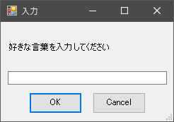
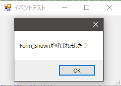

## フォーム編

### フォーム作成の流れ

フォームに表示する各コントロールのオブジェクトを作成  
↓  
フォームオブジェクトを作成  
↓  
フォームに各コントロールオブジェクトを登録  
↓  
フォーム表示

### フォームの基本サンプル

```powershell
################################################################################
## おまじない
################################################################################
#.NETのFormsクラスを読み込む
Add-Type -AssemblyName System.Windows.Forms
#.NETのDrawingクラスを読み込む
Add-Type -AssemblyName System.Drawing

################################################################################
## 各種コントロール
################################################################################
## OKボタンの設定
#ボタンコントロールオブジェクトを作成
$OKButton = New-Object System.Windows.Forms.Button
#コントロールの表示位置を設定
$OKButton.Location = New-Object System.Drawing.Point(40,100)
#コントロールのサイズを設定
$OKButton.Size = New-Object System.Drawing.Size(75,30)
#ボタンに表示するテキストを設定
$OKButton.Text = "OK"
#ダイアログの返り値を設定
$OKButton.DialogResult = "OK"

## キャンセルボタンの設定
#ボタンコントロールオブジェクトを作成
$CancelButton = New-Object System.Windows.Forms.Button
#コントロールの表示位置を設定
$CancelButton.Location = New-Object System.Drawing.Point(130,100)
#コントロールのサイズを設定
$CancelButton.Size = New-Object System.Drawing.Size(75,30)
#ボタンに表示するテキストを設定
$CancelButton.Text = "Cancel"
#ダイアログの返り値を設定
$CancelButton.DialogResult = "Cancel"

## ラベルの設定
#ボタンコントロールオブジェクトを作成
$label = New-Object System.Windows.Forms.Label
#コントロールの表示位置を設定
$label.Location = New-Object System.Drawing.Point(10,30)
#コントロールのサイズを設定
$label.Size = New-Object System.Drawing.Size(250,20)
#ラベルのテキストを設定
$label.Text = "好きな言葉を入力してください"

## テキストボックスの設定
#テキストボックスコントロールオブジェクトを作成
$textBox = New-Object System.Windows.Forms.TextBox
#コントロールの表示位置を設定
$textBox.Location = New-Object System.Drawing.Point(10,70)
#コントロールのサイズを設定
$textBox.Size = New-Object System.Drawing.Size(225,50)

################################################################################
## フォーム
################################################################################
#フォームオブジェクトを作成
$form = New-Object System.Windows.Forms.Form
#フォームのキャプションを設定
$form.Text = "入力"
#フォームのサイズを設定
$form.Size = New-Object System.Drawing.Size(260,180)

#フォームの決定ボタンとしてOKボタンコントロールを登録
$form.AcceptButton = $OKButton
#フォームのキャンセルボタンとしてキャンセルボタンコントロールを登録
$form.CancelButton = $CancelButton

#フォームにOKボタンコントロールを追加
$form.Controls.Add($OKButton)
#フォームにキャンセルボタンコントロールを追加
$form.Controls.Add($CancelButton)
#フォームにラベルコントロールを追加
$form.Controls.Add($label)
#フォームにテキストボックスコントロールを追加
$form.Controls.Add($textBox)

#フォームを表示させ、その結果を受け取る
$result = $form.ShowDialog()

#フォームの結果による処理分岐
if ($result -eq "OK")
{
    $x = $textBox.Text
    $x
}
```

実行結果  


### イベントハンドラ

各コントロール及びフォームオブジェクトにイベントハンドラを登録するには  
`$<オブジェクト>.Add_<イベント名>({<イベントハンドラ>})`  
という構文で登録できる。

```powershell
################################################################################
## おまじない
################################################################################
#.NETのFormsクラスを読み込む
Add-Type -AssemblyName System.Windows.Forms
#.NETのDrawingクラスを読み込む
Add-Type -AssemblyName System.Drawing

################################################################################
## イベントハンドラ
################################################################################
#フォームが表示されたときのイベントハンドラ
function Form_Shown(){
    [System.Windows.MessageBox]::Show("Form_Shownが呼ばれました！")
}

################################################################################
## フォーム
################################################################################
#フォームオブジェクトを作成
$form = New-Object System.Windows.Forms.Form
#フォームのサイズを設定
$form.Size = New-Object System.Drawing.Size(260,180)
#フォームのキャプションを設定
$form.Text = "イベントテスト"

#フォームが表示された時のイベントハンドラを登録
$form.Add_Shown({Form_Shown})

#フォームを表示させる。
$form.ShowDialog()
```

実行結果  


[戻る](/README.md)