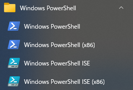

## 環境編

### PowerShell ISEの起動

PowerShell及びPowerShell ISEは、デフォルトでスタートメニューに入っている。

`スタートメニュー → 「Windows PowerShell」`  


ちなみにPowerShell本体及びISEは、  
`C:\Windows\System32\WindowsPowerShell\v1.0` (64bit)  
`C:\Windows\SysWOW64\WindowsPowerShell\v1.0` (32bit)  
に格納されている。

### PowerShell ISEでデバッグできない！

PowerShell ISEを起動し、画面下部のプロンプトで以下のコマンドを入力しEnter。

```powershell
> Get-ExecutionPolicy
```

結果が `Restricted` になっている場合は（というかそうなってるはず）、  
下記のコマンドを入力しEnter、「実行ポリシーの変更」メッセージが表示されるので、  
「はい」を押す。  
（実行ポリシーの内容は「スクリプトの実行ポリシー一覧」を参照)

```powershell
> Set-ExecutionPolicy -Scope CurrentUser RemoteSigned
```

>>>
`Set-ExecutionPolicy` のデフォルトのスコープは `LocalMachine` となっているため<br>
コマンド実行に管理者権限が必要となってしまうが、<br>
`-Scope CurrentUser` を追加することで現ユーザープロファイルにスコープが<br>
変更されるため、管理者権限で実行しなくても実行ポリシーを変更できる。<br>
なおこの設定は永続的な設定になるため注意が必要。<br>
>>>

### スクリプト起動

Windowsのデフォルト設定では `.ps1` ファイルを直接実行できない。  

`powershell.exe` 起動時に、 `-ExecutionPolicy` オプションで実行ポリシーを一時的に変更可能。

```
> powershell.exe -ExecutionPolicy Bypass -File <スクリプトのパス>
```

### スクリプトの実行ポリシー一覧

| 実行ポリシー | 署名付き | 署名なし／ローカル | 署名なし／非ローカル | 概要 |
| --- | :---: | :---: | :---: | --- |
| Restricted | × | × | × | 全てのスクリプトが実行禁止。<br>(PowerShellまたはWindows OSインストール直後のデフォルト)
| AllSigned | ○ | × | × | 署名されているスクリプトのみが実行可能。<br>署名されていないスクリプトは実行禁止
| RemoteSigned | ○ | ○ | × | ローカルに保存されているスクリプトは実行可能。<br>インターネットからダウンロードしたスクリプト（非ローカルのスクリプト）は、<br>署名されているもののみが実行可能。 |
| Unrestricted | ○ | ○ | △ | 全てのスクリプトが実行可能。<br>ただしインターネットからダウンロードしたスクリプトは、<br>実行するかどうかが確認される。 |
| Bypass | ○ | ○ | ○ | 警告やユーザーへの確認なしに、全てのスクリプトが実行可能 |


### Formアプリケーション起動中プロンプト画面が邪魔！

スクリプト起動オプションに `-WindowStyle Hidden` を追加することで  
Formアプリケーション起動時にプロンプト画面が消えるようになる。

### それでも起動時に一瞬プロンプト画面が表示されるんですけど！

ショートカットを作って「実行時の大きさ」を「最小化」にすることで抑止できる。

### ODBCドライバ

スクリプトが動作しているPowerShellと同じアーキテクチャのODBCドライバしか使用できない。  
（64bit版のPowerShellでスクリプトを動作させるなら64bit版のODBCドライバが必要)

[戻る](/README.md)